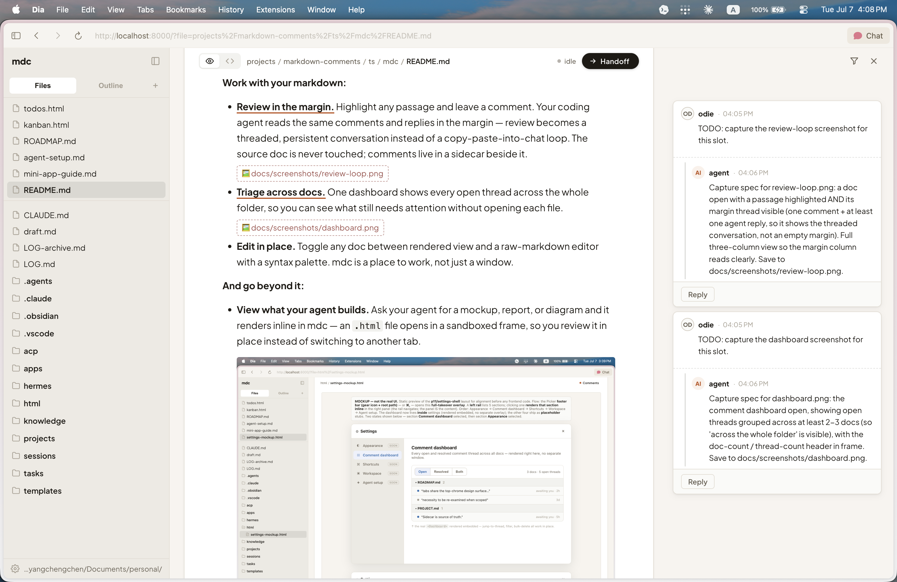
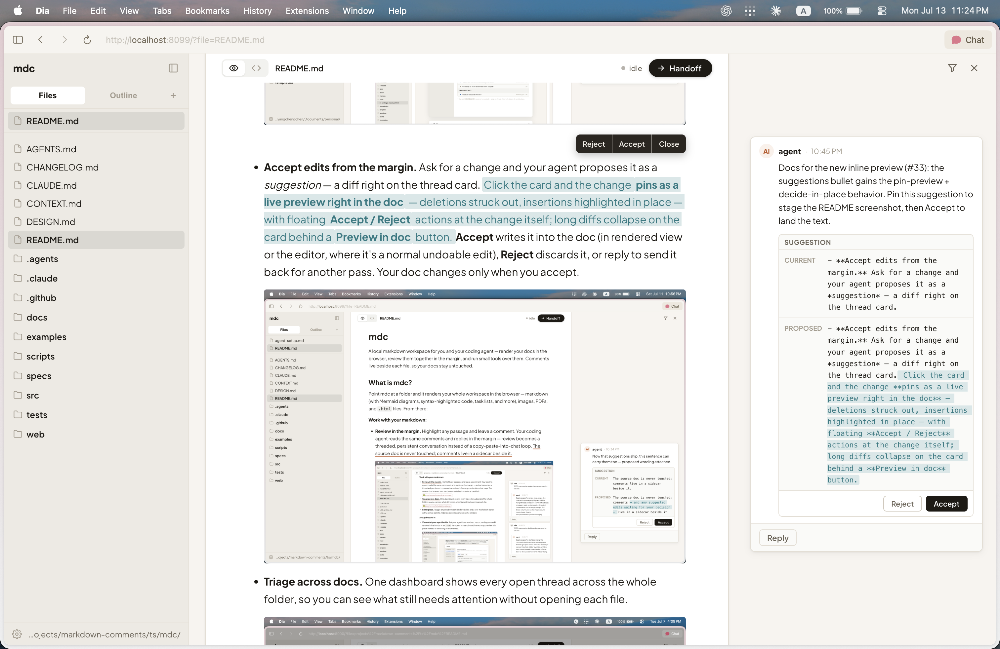
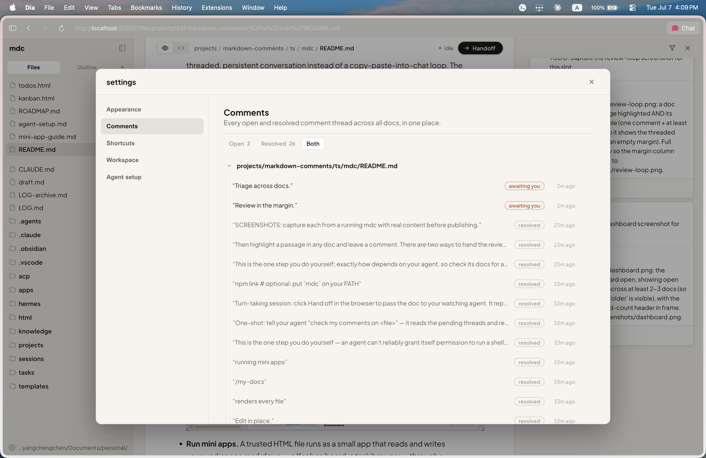
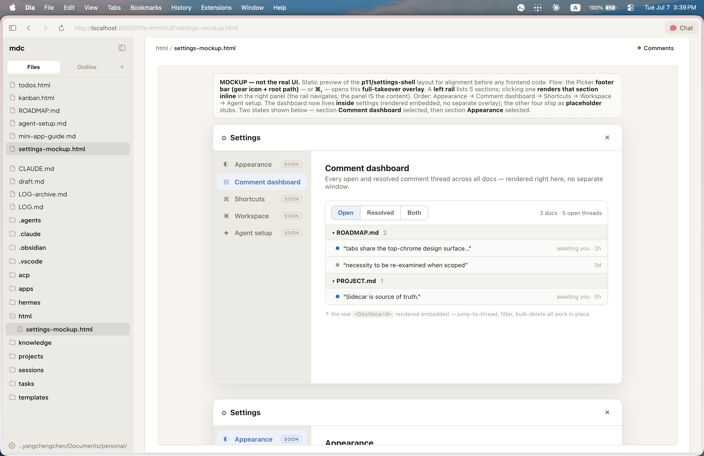
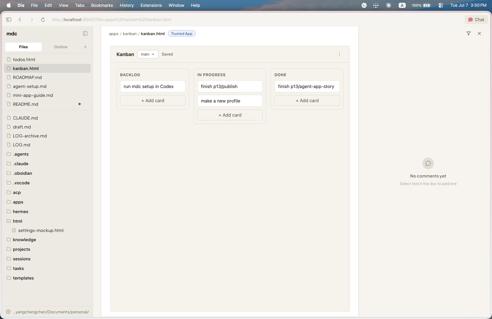

# mdc

A local markdown workspace for you and your coding agent — render your docs in the browser, review them together in the margin, and run small tools over them. Comments live beside each file, so your docs stay untouched.

## What is mdc?

Point mdc at a folder and it renders your whole workspace in the browser — markdown (with Mermaid diagrams, syntax-highlighted code, task lists, and more), images, PDFs, and `.html` files. From there:

**Work with your markdown:**

- **Review in the margin.** Highlight any passage and leave a comment. Your coding agent reads the same comments and replies in the margin — review becomes a threaded, persistent conversation instead of a copy-paste-into-chat loop. The source doc is never touched; comments — and any suggested edits waiting for your decision — live in a sidecar beside it.

  

- **Accept edits from the margin.** Ask for a change and your agent proposes it as a *suggestion* — a diff right on the thread card. Click the card and the change **pins as a live preview right in the doc** — deletions struck out, insertions highlighted in place — with floating **Accept / Reject** actions at the change itself; long diffs collapse on the card behind a **Preview in doc** button. **Accept** writes it into the doc (in rendered view or the editor, where it's a normal undoable edit), **Reject** discards it, or reply to send it back for another pass. Your doc changes only when you accept.

  

- **Triage across docs.** One dashboard shows every open thread across the whole folder, so you can see what still needs attention without opening each file.

  

- **Edit in place.** Toggle any doc between rendered view and a raw-markdown editor with a syntax palette (`⌘/`). mdc is a place to work, not just a window.

**And go beyond it:**

- **View what your agent builds.** Ask your agent for a mockup, report, or diagram and it renders inline in mdc — an `.html` file opens in a sandboxed frame, so you review it in place instead of switching to another tab.

  

- **Run mini apps.** A trusted HTML file runs as a small app that reads and writes your workspace markdown — a Kanban board, a task browser — through a permissioned bridge.

  

**And even more.** Create and organize files and folders, open several docs in tabs, jump by outline or fuzzy file search, edit and reply to individual comments, follow `[[wikilinks]]` and section anchors, render Mermaid diagrams, switch between light and dark — and a keyboard shortcut for most of it.

## Quick start

Requires Node 20+.

```sh
# Run without installing (./my-docs is the folder to serve)
npx mdc-workspace serve ./my-docs

# …or install it globally, then run `mdc` anywhere
npm install -g mdc-workspace
mdc serve ./my-docs
```

`serve` renders the folder's contents and opens it in your browser. Browse the file tree, read your docs, and view any images, PDFs, or HTML inline. The server keeps running in the background — that's all you need to look around.

To review docs with an agent or run mini apps, set your agent up next.

## Set up your agent

Reviewing docs together, viewing what your agent builds, and building mini apps all run through a coding agent. mdc works with **any coding agent that can run shell commands** — it reads and writes comments through the `mdc` CLI while you drive the browser.

Setup is a one-time thing: tell your agent to run **`mdc setup`** and follow it. That guide walks the agent through everything — the review loop, persisting the instructions, and getting standing approval for the `mdc` command — checking in with you where it needs your OK. When it's done, you and your agent are wired up; the ways to review below just work.

See [`docs/agent-setup.md`](docs/agent-setup.md) for the complete agent-facing guide.

## Reviewing with an agent

Set the name mdc displays for you (defaults to `user`), so it can tell your comments apart from the agent's:

```sh
mdc identity "Your Name"
```

Highlight a passage in any doc and leave a comment. Then review it one of two ways — the way you ask decides which:

- **Ask once.** Tell your agent to review your comments on the file. It reads the pending threads, replies in the margin, and stops. The simplest way in.
- **Review together.** Ask your agent to review with you, and it watches the file for a back-and-forth: each time you click **Hand off** it replies, then re-arms for the next round, until you click **End session**. Your agent knows how to start this from `mdc setup`.

Either way, when a thread calls for a doc change the agent attaches a suggestion — you'll see the diff on its card and can **Accept** (the file updates in place), **Reject**, or keep the conversation going. Deciding is always yours, in the browser.

The **Hand off** button is how you pass the doc to a watching agent mid-session. If no agent is connected when you click it, it copies a ready-to-paste prompt instead — a quick way to kick off a review from the clipboard.

## Mini apps

A **mini app** is a single trusted HTML file that reads and writes your workspace through a `window.mdc` bridge — for example, a Kanban board backed by your markdown files. Try a packaged one:

```sh
mdc example kanban
```

Then open the copied `.html` in mdc and trust it to run.

**Ask your agent to build one.** Describe the tool you want over your workspace files and it writes the HTML — or modifies an app you already have. The build contract lives in [`docs/mini-app-guide.md`](docs/mini-app-guide.md): the bridge API, manifest format, sandbox limits, and design conventions.

**Trust model.** Apps are sandboxed: an untrusted HTML file renders read-only with no file access. When you explicitly trust an app, it runs with `allow-scripts` only (no same-origin access) and can read and write files through the mediated bridge — within a declared scope, and with a confirmation at the moment it writes outside its own folder. Trust is recorded per-workspace in `.mdc.toml` under an `[apps]` table that mdc writes for you (editing an app's file re-prompts for trust); you don't edit it by hand.

## CLI

The commands you'll use directly:

| Command | What it does |
| --- | --- |
| `mdc serve [root]` | Serve a folder in the browser (defaults to the current directory). `--force` moves a running server to a new root. |
| `mdc open <file>` | Focus a file in the already-open browser tab. |
| `mdc stop` | Stop the running server. |
| `mdc check` | Report whether a server is running. |
| `mdc identity [name]` | Show or set your display name (`~/.mdc.toml`). |
| `mdc setup` | Print the agent setup guide (meant for your agent to read). |
| `mdc example [name]` | Copy a packaged example app into the workspace (omit the name to list them). |

Your agent uses a second set of commands to read and reply to comments (`comment`, `reply`, `resolve`, `watch`, `list-pending`, …) — those are covered by `mdc setup`. Run `mdc --help` for the full reference and flags.

## Run from source

```sh
git clone <repo-url>
cd mdc
npm install
npm run build      # builds the frontend bundle + CLI
npm link           # optional: put `mdc` on your PATH

mdc serve ./my-docs
```

Run the test suite with `npm test`.

## License

[MIT](LICENSE) © Yang-Cheng Chen
